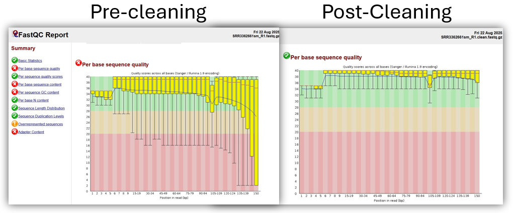

# Nextflow Fastq Quality Control Pipelines
<i> Fastq metrics and trimming for paired-end reads</i>

## Available Pipelines: (2)

#### 1) FastqQC-PE
- Trims on quality and adaptors
- Determines library strandedness
- Removes reads that map to rRNA
- Collects pre/post-cleaning QC metrics

#### 2) FastqQC-PE-UMI
- Trims on quality and adaptors
- Determines library strandedness
- <b>Moves UMIs</b> to read headers
- Removes reads that map to rRNA
- Collects pre/post-cleaning QC metrics

## Running the pipelines:
- Download the scripts and nextflow.config files
- Configure your input and output folders as parameters
- Script can be run in <b>docker</b> by setting nextflow.config file's docker setting to "true". That will execute the pipeline in container cbreuer/fastqc_preprocess:latest which has the required programs for all nextflow scripts.
- Running locally without Docker - required command line tools:
	- python 3
	- Java 17
	- seqkit
	- fastp
	- FastQC
	- seqtk
	- AWS CLI (optional)

## Processing Steps - <i>FastQC-PE</i>:
1. <b>Fastq statistics</b> - seqkit stats is used to collect basic metrics about the fastq files including the number of sequences, minimum and maximum sequence lengths, average length, sum of lengths, and the format and type of sequences in the file. 
2. <b>Determine Strandedness</b> - salmon determines the library strandedness 
3. <b>QC (pre-cleaning)</b> - FastQC is used to collect metrics on per-base quality scores. 
4. <b>Fastq cleaning</b> - fastp is used to trim on adaptors and quality. 
5. <b>rRNA Read Removal</b> - SortMeRNA removes rRNA reads (user adjusts the target sequence)
6. <b>QC (post-cleaning)</b> - FastQC is used again to collect metrics on cleaned fastq files. 

## Processing Steps - <i>FastQC-PE-UMI</i>:
1. <b>Fastq statistics</b> - seqkit stats is used to collect basic metrics about the fastq files including the number of sequences, minimum and maximum sequence lengths, average length, sum of lengths, and the format and type of sequences in the file. 
Process: "INTEGRITY_STATS". 
2. <b>Determine Strandedness</b> - salmon determines the library strandedness 
3. <b>QC (pre-cleaning)</b> - FastQC is used to collect metrics on per-base quality scores. 
4. <b>UMI Extraction</b> - UMI-tools moves UMIs to read headers 
5. <b>Fastq cleaning</b> - fastp is used to trim on adaptors and quality. 
6. <b>rRNA Read Removal</b> - SortMeRNA removes rRNA reads (user adjusts the target sequence)
7. <b>QC (post-cleaning)</b> - FastQC is used again

## Quality Metrics
- seqkit outputs general statistics
 

 - fastp trimming results
 

 - fastp fragment length analysis
 

- FastQC per-base PHRED scores (pre-cleaning)

# Notes:
- My dockerfile for container cbreuer/fastq_quality_control is included if needed.

# Background work:
Create a sortmerna index:
- Open rrna-db-defaults.txt and [download](https://www.arb-silva.de/download/arb-files/) the silva database containing the rRNA sequences appropriate for your library. Keeping the number of sequences to a minimum is advised because the processing time of sortmerna can be high. Combine the desired sequences into a single .fa (your 'ribo_fasta.fa' sequence) file and run a one sortmerna example analysis with dummy fastq files. This will cause sortmerna to create the index in the work folder/idx. It's the /idx folder you want to keep and reuse. Point the nextflow paramter.
- Save the .fa file with the rRNA sequences used to make the sortmerna library. Point the nextflow paramter at the file. 
Create a salmon index:
- A tutorial is [here](https://combine-lab.github.io/salmon/getting_started/#indexing-txome)). Briefly: use "salmon index -t genome.fa.gz -i salmon_gnm_name" and point the nextflow parameter to the index folder.