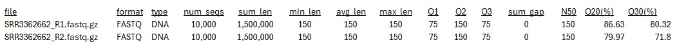
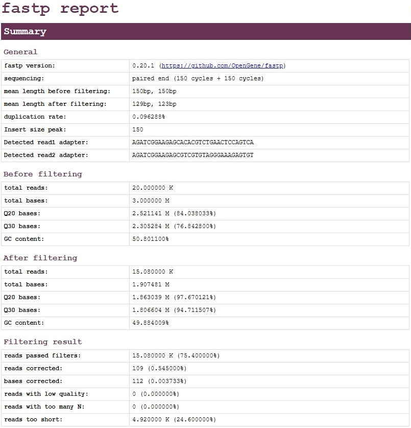
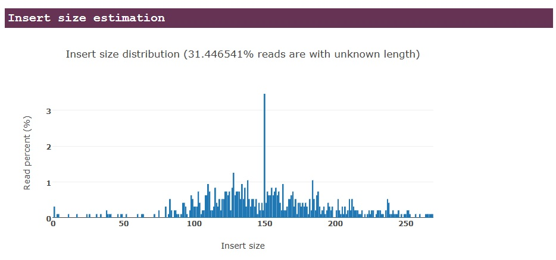
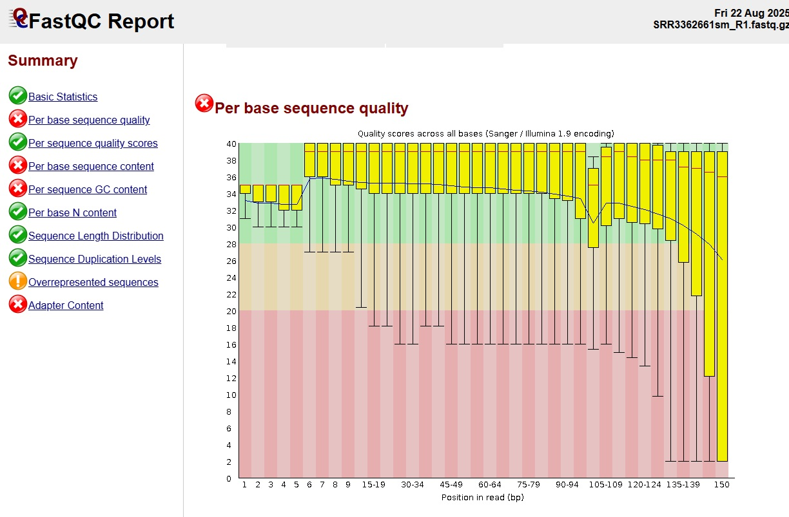
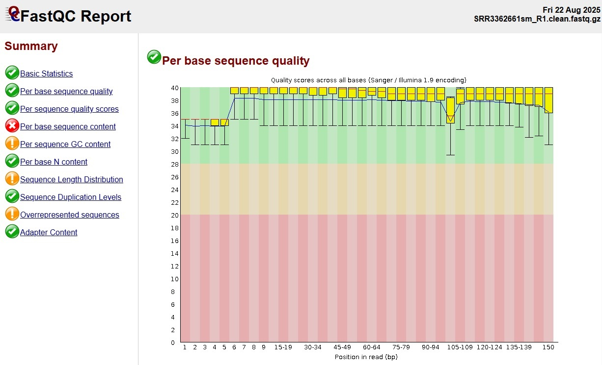

# Nextflow Fastq Quality Control
<i> Fastq metrics and trimming for paired-end reads</i>

## Pipeline Overview:
<i> Inputs: Paired end fastq files named *_R1.fastq.gz / *_R2.fastq.gz</i> 
<i> Outputs: Cleaned fastq file pairs and metrics</i> 
<i> Run: "nextflow fastqQC.nf"</i>

## Running the pipeline:
- Configure your input and output folders as parameters (ensure the output folder exists before running)
- The script can be run with <b>docker</b> by setting nextflow.config file's docker setting to "true". That will execute the pipeline in container cbreuer/fastqc_quality_control:latest which has the required programs.
- Running outside of docker: (required)
	- seqkit
	- fastp
	- FastQC
	- AWS CLI (optional)

## Processing Steps:
1. <b>Fastq statistics</b> - seqkit stats is used to collect basic metrics about the fastq files including the number of sequences, minimum and maximum sequence lengths, average length, sum of lengths, and the format and type of sequences in the file. 
Process: "INTEGRITY_STATS". 
2. <b>Fastq quality control (pre-cleaning)</b> - FastQC is used to collect metrics on per-base quality scores. 
Process "FASTQC_RAW"
3. <b>Fastq cleaning</b> - fastp is used to trim on adaptors and quality. 
Process: "FASTP_CLEAN_PE".
4. <b>Fastq quality control (post-cleaning)</b> - FastQC is used again to collect metrics on cleaned fastq files.
Process: "FASTQC_CLEAN_PE". 

## Quality Metrics
- seqkit outputs general statistics
 

 - fastp trimming results
 

 - fastp fragment length analysis
 

- FastQC per-base PHRED scores (pre-cleaning)

- FastQC per-base PHRED scores (post-cleaning)

# Notes:
- My dockerfile for container cbreuer/fastq_quality_control is included if needed.